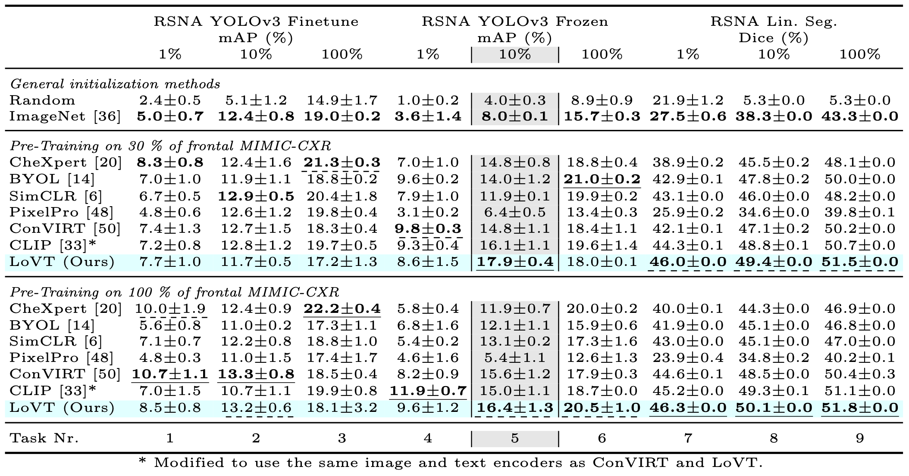

# Localized Vision-Text Pre-Training
Contrastive learning has proven effective for pre-
training image models on unlabeled data and achieved
great results in medical image classification. Using paired
text like radiology reports during pre-training improved the
results even further. Still, most existing methods target im-
age classification as downstream tasks and may not be opti-
mal for localized tasks like semantic segmentation or object
detection. We therefore propose LoVT, to our best knowl-
edge, the first text-supervised pre-training method that tar-
gets localized medical imaging tasks. Our method com-
bines instance-level scan-report contrastive learning with
local contrastive learning on scan region and report sen-
tence representations. We evaluate LoVT and commonly
used pre-training methods on a novel evaluation framework
consisting of 18 localized tasks on chest X-rays from five
public datasets. While there is no single best method, LoVT
performs best on 11 out of the 18 studied tasks making it the
method of choice for localized tasks

## Results

See sections Pre-Training and Evaluation (in this README) for details on how the shown results can be reproduced.

## Setup and Preparation
### Setup Environment
- Prepare the conda environment:

    conda env create -f environment.yaml

- Setup wandb and model paths
    - Create a folder where you store datasets, we will refer to this folder as `<path_to_datasets>`
    - Create a folder where you store models, we will refer to this folder as `<models base path>`
    - Make sure you have an account at https://wandb.ai/
    - Update the file `configs/user_config.yaml` and set `models.base_path` to `<models base path>` and `wandb.user` to your wandb user-name
      (You can also update `wandb.project` if you like).

- Note: all temporary training data and logging will be stored at `logs` (a subfolder within this project). This folder can get very large, so make sure to clean up this folder after running jobs.

### Dataset Preparation for Pre-Training and Evaluation
#### MIMI-CXR
- Download the MIMIC-CXR-JPG dataset 
  from `https://physionet.org/content/mimic-cxr-jpg/2.0.0/` into the folder `<path_to_datasets>/MIMIC-CXR`
- Download all files of the MIMIC-CXR dataset except the DICOM files (i.e. except the folder `files`) 
  from `https://physionet.org/content/mimic-cxr/2.0.0/` into the folder `<path_to_datasets>/MIMIC-CXR`
- Preprocess the dataset by calling
  
      python src/data/datasets/mimic_cxr/mimic_cxr_dataset.py create <path_to_datasets>/MIMIC-CXR --config mimic-cxr_ap-pa

- Create the image-listing (required for the image-only baselines) by calling

      python src/data/datasets/mimic_cxr/mimic_cxr_dataset.py create_image_list --path <path_to_datasets>/MIMIC-CXR/mimic-cxr_ap-pa_dataset
    
- Update the paths in the config files:
    - `configs/dataset/mimic-cxr_ap-pa_find-impr.yaml`
    - `configs/dataset/mimic-cxr_ap-pa_find-impr_03.yaml`
    - `configs/dataset/mimic-cxr-img_ap-pa_find-impr.yaml`
    - `configs/dataset/mimic-cxr-img_ap-pa_find-impr_03.yaml`

#### RSNA Pneumonia Detection
- Download and extract the RSNA Pneumonia Detection dataset
  from `https://www.kaggle.com/c/rsna-pneumonia-detection-challenge/` into the folder `<path_to_datasets>/RSNA-Pneunomia-Detection`
- Preprocess the dataset by calling
  
      python src/data/datasets/rsna_pneunomia_detection/rsna_pneunomia_detection_dataset.py <path_to_datasets>/RSNA-Pneunomia-Detection
- For reproducability copy the files `train.csv`, `validation.csv`, `test.csv`, and `dataset_statistics.json`
  from `datasets/RSNA-Pneumonia-Detection` to `<path_to_datasets>/RSNA-Pneunomia-Detection` (overwrite the existing files)
- Update the paths in the config files:
    - `configs/dataset/rsna.yaml`
    - `configs/dataset/rsna_01.yaml`
    - `configs/dataset/rsna_001.yaml`
    - `configs/dataset/rsna_seg.yaml`
    - `configs/dataset/rsna_seg_01.yaml`
    - `configs/dataset/rsna_seg_001.yaml`
    
#### COVID Rural
- Download and extract the COVID Rural dataset
  from `https://github.com/haimingt/opacity_segmentation_covid_chest_X_ray` into the folder `<path_to_datasets>/Opacity-Segmentation-COVID`.
  This folder should now contain the subfolder `<path_to_datasets>/Opacity-Segmentation-COVID/opacity_segmentation_covid_chest_X_ray-master/covid_rural_annot`
- Preprocess the dataset by calling
  
      python src/data/datasets/COVID_rural/covid_rural_dataset.py <path_to_datasets>/Opacity-Segmentation-COVID/opacity_segmentation_covid_chest_X_ray-master/covid_rural_annot
- For reproducability copy the files `train.csv`, `validation.csv`, `test.csv`, and `dataset_statistics.json`
  from `datasets/Opacity-Segmentation-COVID/opacity_segmentation_covid_chest_X_ray-master/covid_rural_annot` 
  to `<path_to_datasets>/Opacity-Segmentation-COVID/opacity_segmentation_covid_chest_X_ray-master/covid_rural_annot` (overwrite the existing files)
- Update the paths in the config file:
    - `configs/dataset/covid_rural.yaml`
    
#### SIIM Pneumothorax Segmentation
- Download and extract the SIIM Pneumothorax Segmentation dataset
  from `https://www.kaggle.com/seesee/siim-train-test/` into the folder `<path_to_datasets>/siim-acr-pneumothorax-segmentation`
- Preprocess the dataset by calling
  
      python src/data/datasets/siim_acr_pneumothorax/siim_acr_pneumothorax.py <path_to_datasets>/siim-acr-pneumothorax-segmentation
- For reproducability copy the files `train.csv`, `validation.csv`, `test.csv`, and `dataset_statistics.json`
  from `datasets/siim-acr-pneumothorax-segmentation` to `<path_to_datasets>/siim-acr-pneumothorax-segmentation` (overwrite the existing files)
- Update the paths in the config file:
    - `configs/siim_pneumothorax.yaml`

#### Object CXR
- Download the Object CXR dataset
  from `https://jfhealthcare.github.io/object-CXR/` into the folder `<path_to_datasets>/object-CXR/input`.
  An alternative mirror of the dataset can be found at `https://academictorrents.com/details/fdc91f11d7010f7259a05403fc9d00079a09f5d5`
- Extract `<path_to_datasets>/object-CXR/input/train.zip` and `<path_to_datasets>/object-CXR/input/dev.zip`
- Preprocess the dataset by calling
  
      python src/data/datasets/object_cxr/object_cxr_dataset.py <path_to_datasets>/object-CXR
- For reproducability copy the files `train.csv`, `validation.csv`, `test.csv`, and `dataset_statistics.json`
  from `datasets/object-CXR` to `<path_to_datasets>/object-CXR` (overwrite the existing files)
- Update the paths in the config files:
    - `configs/object-cxr.yaml`
    - `configs/object-cxr_seg.yaml`

#### NIH CXR Pathology Detection
- Download the NIH CXR Pathology Detection dataset
  from `https://nihcc.app.box.com/v/ChestXray-NIHCC/` into the folder `<path_to_datasets>/NIH_CXR_pathology_detection`
- Preprocess the dataset by calling
  
      python src/data/datasets/nih_cxr/nih_cxr_dataset.py <path_to_datasets>/NIH_CXR_pathology_detection
- For reproducability copy the files `train.csv`, `validation.csv`, `test.csv`, and `dataset_statistics.json`
  from `datasets/NIH_CXR_pathology_detection` to `<path_to_datasets>/NIH_CXR_pathology_detection` (overwrite the existing files)
- Update the paths in the config files:
    - `configs/nih-cxr.yaml`
    - `configs/nih-cxr_seg.yaml`

## Pre-Training
### LoVT
To train the LoVT model (on 100% of the data) with the same setting as in our paper call:

    python src/scripts/run_training.py +experiment=LoVT_100

To train it on 30% of the data call:

    python src/scripts/run_training.py +experiment=LoVT_30

To change hyperparameters prepare or update a yaml experiment config in the folder `configs/experiment`.
The experiment can the be run using `python src/scripts/run_training.py +experiment=<name_of_you_config_without_yaml_ending>`.
The configs for our ablation study can be found in `configs/experiment/ablation`. 
For details on how to define experiments see existing yaml-files as reference and the Hydra documentation (https://hydra.cc/)
as the Hydra library is used to load configs.
The model details of an experiment are defined within `pretrain_model:` of the experiment config and are based on `src/models/pretraining/pretraining_utils.py BiModalModelConfig`.
For the scan encoder config see the configs in `configs/scan_encoder` and `src/models/image/scan_encoder.py ScanEncoderConfig`.
For the report encoder config see the configs in `configs/report_encoder` and `src/models/text/report_encoder.py ReportEncoderConfig`.
For the objective configs see the configs in `configs/objective` and 
    `src/models/objectives/global_alignment.py GlobalNceLossConfig`, `src/models/objectives/local_alignment.py LocalIntraSampleContrastiveLossConfig`

### Baselines
#### CheXpert
To train supervised CheXpert on 100% of the MIMIC-CXR data with the same setting as in our paper call:

    python src/baselines/supervised_baseline.py +baseline@model_config=chexpert_100 name=chexpert_100

To train supervised CheXpert on 30% of the MIMIC-CXR data with the same setting as in our paper call:

    python src/baselines/supervised_baseline.py +baseline@model_config=chexpert_30 name=chexpert_30

#### BYOL
To train BYOL on 100% of the data with the same setting as in our paper call:

    python src/baselines/byol_baseline.py +baseline@model_config=byol_100 name=byol_100

To train BYOL on 30% of the data with the same setting as in our paper call:

    python src/baselines/byol_baseline.py +baseline@model_config=byol_30 name=byol_30

#### SimCLR
To train SimCLR on 100% of the data with the same setting as in our paper call:

    python src/baselines/simclr_baseline.py +baseline@model_config=simclr_100 name=simclr_100

To train SimCLR on 30% of the data with the same setting as in our paper call:

    python src/baselines/simclr_baseline.py +baseline@model_config=simclr_30 name=simclr_30

#### PixelPro
To train PixelPro on 100% of the data with the same setting as in our paper call:

    python src/baselines/byol_baseline.py +baseline@model_config=pixelpro_100 name=pixelpro_100

To train PixelPro on 30% of the data with the same setting as in our paper call:

    python src/baselines/byol_baseline.py +baseline@model_config=pixelpro_30 name=pixelpro_30

Note that using `src/baselines/byol_baseline.py` is not a typo but both use a similar framework which is why both share the same training file.

#### ConVIRT
ConVIRT is pre-trained using our LoVT code but with a different experiment config.
To train the ConVIRT model on 100% of the data with the same setting as in our paper call:

    python src/scripts/run_training.py +experiment=ConVIRT_100

To train it on 30% of the data call:

    python src/scripts/run_training.py +experiment=ConVIRT_30

## Evaluation
### LoVT or ConVIRT
To evaluate LoVT or ConVIRT model or models created by another experiment config use:

    python src/analysis/evaluation_job.py evaluate_downstream <model name>

This evaluates the model on the RSNA YOLOv3 Frozen 10% task and can therefore be used during hyperparameter tuning.
The <model name> is the name of the model as specified in the `name` field of an experiment config, e.g. `LoVT_100`.
The model to evaluate has to be located in the folder `<models base path>/pretraining/<model name>` where `<model base path>` is specified in the user config.
It is stored there automatically when running pre-training.

The model is evaluated with five runs and the results can be found in `results/generated/downstream_rsna_frozen_10.csv`
(the wandb run ids are stored in the file `results/runs.csv`).

To evaluate a model on other evaluation tasks use:

    python src/analysis/evaluation_job.py evaluate_downstream --evaluate_extended --no-evaluate_basic <model name>

This includes automatic tuning of the downstream learning rates and averaging over five runs.
The results can be found in the files in `results/generated/` (the wandb run ids are stored in the file `results/runs.csv`).

To evaluate a model on all (basic and extended tasks) use:

    python src/analysis/evaluation_job.py evaluate_downstream --evaluate_extended <model name>

### Image Model (pre-trained with other method)
All other baselines can also be evaluated by directly evaluating the pre-trained image encoder (i.e. ResNet).
Therefore use the following for basic evaluations (i.e. RSNA YOLOv3 Frozen 10%):

    python src/analysis/evaluation_job.py evaluate_baseline_downstream <baseline model name>

and for the other tasks:

    python src/analysis/evaluation_job.py evaluate_baseline_downstream --evaluate_extended --no-evaluate_basic <baseline model name>

The baseline model to evaluate has to be located in the folder `<models base path>/baselines/<baseline model name>` where `<model base path>` is specified in the user config.
Within this folder the ResNet weights (of the torchvision ResNet class) have to be located at `<models base path>/baselines/<baseline model name>/checkoints/backbone_weights.pt`.
It is stored there automatically when pre-training baselines with the scripts in `src/baselines`.
The results can be found in the files in `results/generated/` (the wandb run ids are stored in the file `results/runs.csv`).

### Random and ImageNet Init
To evaluate a random initialized ResNet use

    python src/analysis/evaluation_job.py evaluate_baseline_downstream --evaluate_extended random

To evaluate a ImageNet initialized ResNet use

    python src/analysis/evaluation_job.py evaluate_baseline_downstream --evaluate_extended ImageNet

## Analysis and Plotting
To analyze the embeddings (e.g. std) of a model (like LoVT or an ablation) use
    
    python src/analysis/evaluation_job.py analyze --gpu 0 --export <model name> 

The results are stored in the wandb run and can be found in the file `results/generated/analysis-test.csv`

To create plots for a model  (like LoVT or an ablation) use

    python src/analysis/evaluation_job.py plot --gpu 0 --data_plots --downstream_plots --export <model name>

The plots are stored in the model folder, i.e. in `<models base path>/pretraining/<model name>/plots`.
Intermediate values are stored in model subfolders `predictions` and `cached` and can be deleted afterwards.

To create plots of multiple models, e.g. to compare downstream results or embedding properties (std, alignment, ...) 
specify the runs to be plotted in `results/runs_paper.csv` and run the following:
    
    python src/analysis/evaluation_job.py plot_shared --category <category to plot>

This includes all runs in `results/runs_paper.csv` with the specified category and stores the plots at `results/generated`.
In `results/runs_paper.csv` the `name` must match the model name and `paper_name` will be used in the legends, `baseline` should be set to true for baseline models,
`has_local` and `has_global` should be set accordingly to whether the model uses local or global losses, and `order` specifies the order in which the models are shown in plots.
